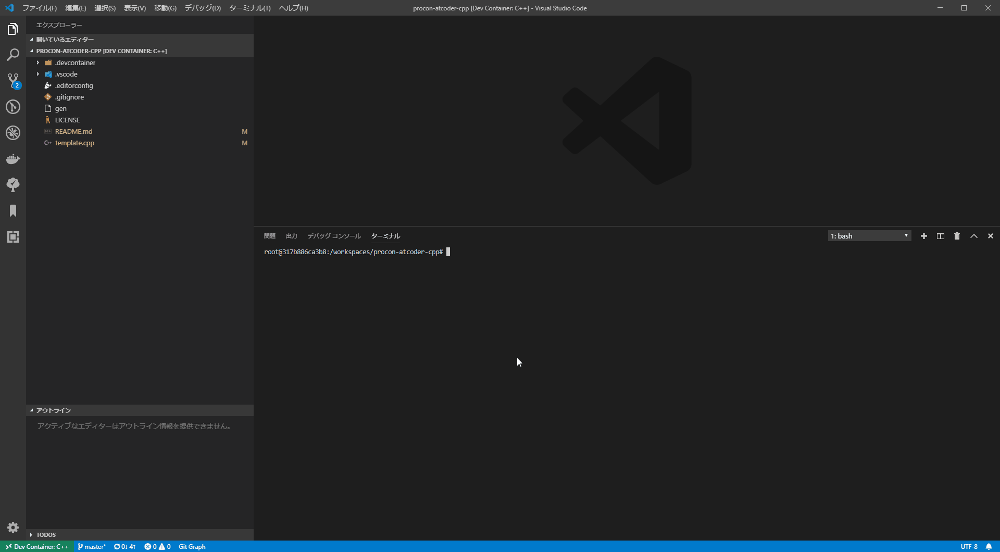

# procon-atcoder-cpp

## Overview

This repository is my C++ workspace/archive for AtCoder.
There are [Python](https://github.com/kenji-miyake/procon-atcoder-python) and [Rust](https://github.com/kenji-miyake/procon-atcoder-rust) version as well.

## Prerequisites

- VSCode
- Remote-Containers(ms-vscode-remote.remote-containers)

## Usage

- Clone this repository.
- Open directory with VSCode.
- Reopen directory in container.
- Generate contest directory.
- Solve contest tasks.

## Example

### 1. On Local Terminal

```sh
git clone https://github.com/kenji-miyake/procon-atcoder-cpp
cd procon-atcoder-cpp
git checkout master
code .
```

### 2. On VSCode GUI

- Remote-Containers: Open Folder in Container...

### 3. On VSCode Terminal

- `./gen abc001` # See https://github.com/kenji-miyake/atcoder-helper for more details.

### 4. On VSCode GUI

- Open `contests/abc001/A/main.cpp`
- Tasks: Run Task -> `oj download` # Download test cases
- Tasks: Run Task -> `atcoder-tools codegen` # Generate template file with scanner impremented
- Tasks: Run Task -> `oj test` # Run test (Download required)
- Tasks: Run Task -> `oj login` # Login to AtCoder (.env required)
- Tasks: Run Task -> `oj submit` # Submit code (Login required)

### Tips

I recommend you to assign a shortcut key for "Tasks: Run Task", I use "Ctrl + T".

### Animation



## Dependency

This workspace uses these tools.
Thank you for developing great tools.

- https://github.com/kmyk/online-judge-tools
- https://github.com/kyuridenamida/atcoder-tools
